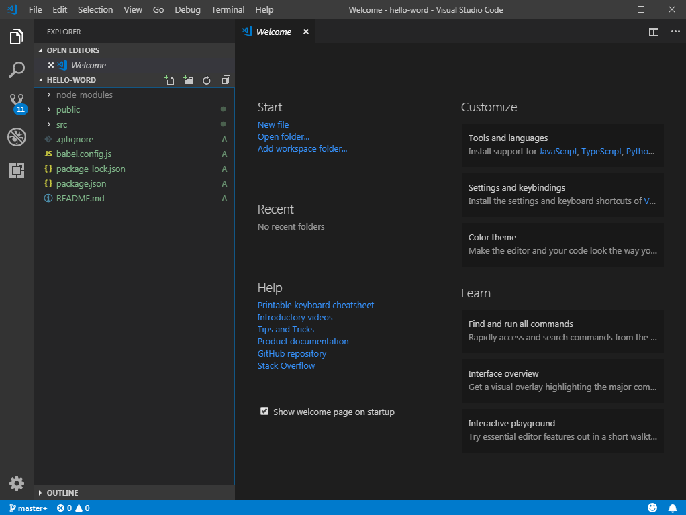

[Vue 官方網站](https://cn.vuejs.org/v2/guide/#)

### Vue.js 是什麼？
- 它是JavaScript的一個框架，可以讓我們快速的開發專案，且他具有動態資料處理的特色，  
    也無需像原生的JavaScript需透過呼叫DOM元素才可取得元件的值。

### 第一步先佈置好電腦的環境
1. 因為會使用到git，所以先下載、安裝git的comman line  
    [載點](https://git-scm.com/downloads)
2. 因接下來會使用到*npm指令*(Node Package Manager)，來安裝及管理我們所有Vue的專案，需先下載、安裝Node.js的套件。  
    [Node.js載點](https://nodejs.org/en/)(下載10.15.3 LTS版本即可) 
3. 安裝完畢後，打開其應用程式(GIT Bash)：  
    (1) [Vue CLI 官網](https://cli.vuejs.org/zh/)
    在GIT GUI輸入以下指令，安裝Vue-CLI的套件(@vue/cli 3.x 版本)：
    ```bash
    npm install -g @vue/cli
    ``` 
    補充：-g 是指全域安裝  
    (2) 因GIT Bash預設開啟位置在 ```C:\Users\[你的User Name]```，所以先切換到桌面的位置：
    ```bash
    cd Desktop
    ``` 
    (3) 接著，開始創建一個Hello-Word專案，  
    運行以下命令來創建一个新專案：
    ```bash
    vue create hello-world
    ```  
    它會問你一些是否在專案中要安裝的其他dependencies(相依套件)，因為我們現在是先練習，所以按enter，直接進入預設即可。  
    完成後，會看到他推荐你的兩行指令：  
    ```bash
    cd hello-word #此為切換到專案的目錄下
    npm run serve #此命令會編譯專案，讓它在本機跑伺服器，大多在 http://localhost:8080/ 的網址下可以看到自己專案跑的情況
    ```
    不過我們現在要換成用Visual Studio Code來開啟專案編輯。  

### 使用 VS code 編輯專案
1. GIT Bash中，在同一資料夾下(C:\Users\\ [你的User Name] \Desktop)，輸入：
    ```bash
    code hello-word #使用Visual Studio 打開整個專案資料夾
    ```
    打開後，應該會呈這個狀態  
      

2. 了解專案架構：  
    (1) node_modules:各dependencies存放的資料夾，每當我們在GIT Bash下執行 ```npm install [dependencies 的名字]```時，npm就會把我們安裝的依賴存放在這個資料夾，而此資料夾是不必存入git的追蹤的，因為它的總檔案大小太大。  
    (2) public:我自己目前是很少用到他，所以可以參考官網資料。 [public 官網參考](https://cli.vuejs.org/zh/guide/build-targets.html#应用)  
    (3) src: 開發最重要的資料夾，大部分的元件，網頁的編輯檔都在這個資料夾操作。  
    底下包含了：
    1. assets:放置生成的静態資源 (js、css、img、fonts)  
    2. components:放置元件。網頁上所看到的任何都是一個個元件所組成的，例如一個Navbar、Container、Footer，他們都是元件，而元件就像積木，讓我們可以堆疊在一個網頁上，做出我們想要的效果。  
    3. App.vue:在此專案中，是網頁的主頁，以路由來講："/"，就是根目錄。  
    4. main.js:掛載router(路由)、store(Vuex會使用到的)的檔案，其餘的我也還不是很熱。  

    (4) .gitignore: git在追蹤(git add)及提交(git commit)時，會被忽略的檔案，因為有些檔案只有在開發時才會使用到，無需傳到網路上。且這樣才不會造成我們在上傳檔案時，花太多時間在很大的檔案上，例如：node_modules就預設在.gitignore裡。  
    (5) babel.config.js:[babel.config.js參考](https://cli.vuejs.org/zh/config/#babel)  
    (6) package.json：它是一種 CommonJS 規定用來描述包的文件，是一個包含 json 格式的說明文件，裡面可以定義相依的相關套件以及應用程式的資訊，可以從 [npm-package.json](https://docs.npmjs.com/files/package.json) 網頁了解到，他基本可以定義 應用程式名稱、版本、描述、關鍵字、授權、貢獻者、維護者、腳本等其他，還有 Node.js 最重要的就是相依套件，dependencies 是以套件名稱和版本號組成的。  
    前面有提過node_modules資料夾不會存入git，那當我們下載別人git的project下來執行時，是不是就會因為我們沒有相依套件而不能執行呢？  
    這時，就是package.json發揮的其中一個效用，當我們在專案的目錄下執行```$ npm install```，npm就會自己到package.json去看這個專案需要什麼套件，進而產生node_modules，幫我們把套件存入。  
    [package.json 參考文件](http://souffle77-blog.logdown.com/posts/1316300-nodejs-package-json)  
    (7) README.md：專案的說明檔。預設都是專案安裝、執行、建置網頁的指令，這些指令都要在專案的目錄下執行才有用喔!  
    解釋指令：  
    1. npm install：安裝套件。```$ npm install [套件名]```  
    2. npm run serve：在本機端執行網頁，讓開發者可以看到程式編寫後的效果。可以先執行這個指令，再開始編寫程式，每當你的專案一有變更，網頁也會同步變更，若程式有錯，他也會顯示錯誤處在網頁上。  
    3. npm run build：將專案打包成一個靜態的網頁，讓開發者可以發佈到網路上。執行這個指令後，會在專案中產生*dist*資料夾，靜態的網頁就是包含在這一個資料夾。  

    =檔案架構就把目前會用到的先介紹=

3. 檔案內容介紹  
    (1) 先進入 src > App.vue  
    - 在網路的世界，要把全部的東西看成一個個的元件(components)，所以你不會在vue裡看熟悉的.html，而是一個個.vue所組成的元件，因此我們先來看根元件App.vue。  
    - .vue裡有三大重要的tag，分別是 *```<template> <script> <style>```* ->  
        - ```<template>```：包在template裡面的DOM元素就是我們熟悉的html格式，能看到```<div> ```等，在template還有重要的一點，全部的東西，一定要用一個div把他們全部包住，這是vue的規定。  
        這時你可能會看到有一個你從來都沒看過的DOM元素```<HelloWorld>```，這就是開發者自定的component，而這個component從哪裡來呢？  
        往下看到```<script>```的部分，有沒有看到
        ```js
        import HelloWorld from './components/HelloWorld.vue'
        ```
        這一行就是從components資料夾中的HelloWorld.vue取得元件，然後輸入到App.vue裡一個名為HelloWorld的Tag。  
        但除了import外，我們還需要註冊這個元件，App.vue他才會認得HelloWorld這個元件。再往下看，  
        ```js
        export default {
            name: 'app',
            //components這一段就是在註冊HelloWorld元件
            components: {
                HelloWorld //此名字要跟上面import後接的名字一樣
                }
            }
        ```  

        - ```<script>```：使用到的js程式碼包含在這裡面。目前看到的屬性只有name及components兩者，往後會再學到data()、methods、props等很多的屬性值，這都是使用JavaScript構成。

        - ```<style>```：css放置的地方。若看到的是```<style scoped>```，代表css的作用域只限於現在這一個.vue檔，若只有```<style>```，則會作用於整個專案。  
         
    (2)  src > HelloWorld.vue  
    - 剛剛在App.vue是不是有看到 **import HelloWorld from './components/HelloWorld.vue'** ，那現在我們就要來看它到底import了長什麼樣的元件。

    - 首先看到的就是```<template>```，再來是前面提到的，template裡一定要用一個div包住全部的tag，再往下一行是
    ```html
     <h1>{{ msg }}</h1>
    ```
    **{{ }}**：這裡看到雙大括號，他是Vue.js裡取得JS變數的方法，這個方法可以讓JS與HTML裡的資料是同步的。  
    那上面的 *msg* 又是哪來的呢？往下拉到```<script>```的地方
    ```js
    export default {
        name: 'HelloWorld',
        props: {
            msg: String
        }
    }
    ```
    看到新的屬性了 -- props，這是子元件接父元件的屬性，父元件就是App.vue。回到 src > App.vue > ```<template>``` > <HelloWorld>
    ```html
    <HelloWorld msg="Welcome to Your Vue.js App"/>
    ```
    <HelloWorld>中的msg 與 HelloWorld.vue > props 中的msg是指同一個變數，從父元件(App.vue)傳一個字串 "Welcome to Your Vue.js App" 到子元件(HelloWorld.vue)props的msg去接這個字串。而後再{{ msg }}，這裡印出字串。
